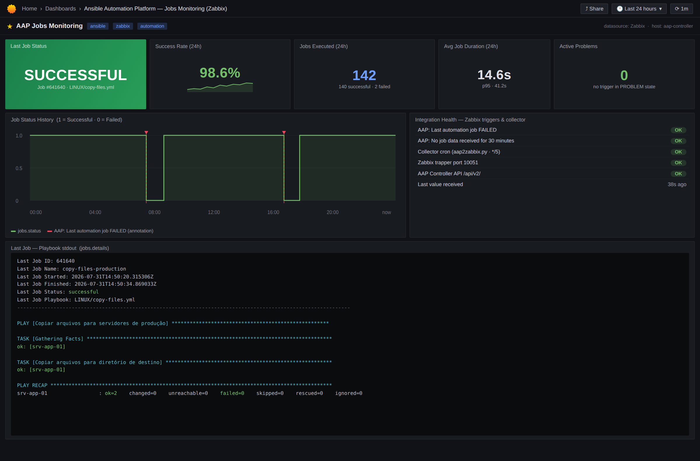
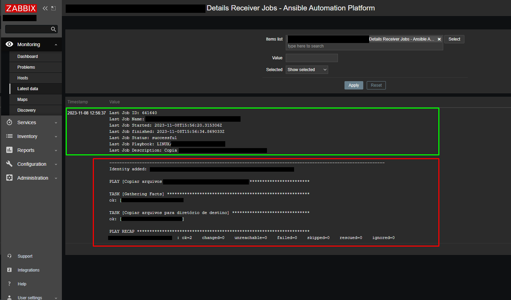
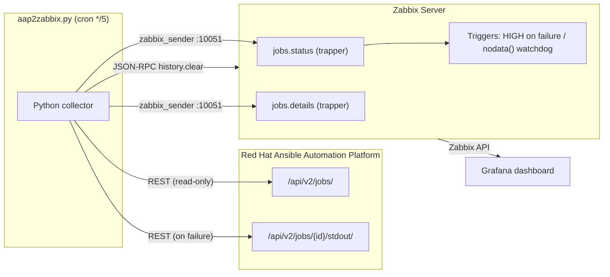

# Zabbix × Red Hat Ansible Automation Platform — Job Monitoring Integration

[](https://www.python.org/)
[](https://www.zabbix.com/)
[](https://www.redhat.com/en/technologies/management/ansible)
[](https://grafana.com/)
[](LICENSE)

> **Monitor every Ansible Automation Platform job from inside Zabbix — including the full playbook stdout — with a single Python collector, two trapper items and zero extra infrastructure.**

Automation without monitoring is a silent risk. When a scheduled playbook fails at 3 a.m. and nobody notices, the automation that should protect your environment becomes an invisible, repeating failure. This project closes that gap: it turns every job executed on **Red Hat Ansible Automation Platform (AAP / Automation Controller)** into a monitored event in **Zabbix**, with the complete Ansible `PLAY RECAP` attached to the alert.

---

## 📊 Dashboards & Screenshots

**Grafana operations dashboard** (via the [Zabbix plugin for Grafana](https://grafana.com/grafana/plugins/alexanderzobnin-zabbix-app/)) — `grafana/aap_jobs_dashboard.json`:



**Zabbix *Latest data*** — a single, always-current snapshot of the last job, header + full playbook stdout:



---

## 🏗️ Architecture



Every 5 minutes the collector:

1. Fetches the most recently finished job: `GET /api/v2/jobs/?order_by=-finished&page_size=1`
2. Clears the trapper items' history via `history.clear`, so *Latest data* always shows **one current snapshot** instead of accumulating kilobytes of log in the database
3. **If the job failed** → downloads the full stdout (`/jobs/{id}/stdout/?format=txt`), pushes it to `jobs.details` and sends `0` to `jobs.status` (fires the **HIGH** trigger)
4. **If the job succeeded** → sends `1` to `jobs.status`

### Why `zabbix_sender` + trapper items?

| Approach | Verdict |
|---|---|
| Prometheus scraping `/api/v2/metrics` | Works, but adds a parallel monitoring stack and **cannot deliver job stdout** |
| Zabbix HTTP agent item | Conditional logic (fetch stdout only on failure) becomes a hard-to-maintain preprocessing puzzle |
| **Python collector + `zabbix_sender` + trapper items** ✅ | Small, versioned, auditable. The collector decides *what* and *when*; Zabbix just receives |

Fewer moving parts → lower MTTR. The operator who receives the alert already sees the Ansible `PLAY RECAP` inside Zabbix — first-level diagnosis happens without ever opening the AAP console.

---

## 📦 Repository layout

```
.
├── aap2zabbix.py                        # The collector (Python 3.9+, stdlib + requests)
├── templates/
│   └── zbx_aap_jobs_template.yaml       # Zabbix 6.0 template: items, value map, triggers
├── grafana/
│   └── aap_jobs_dashboard.json          # Importable Grafana dashboard (Zabbix plugin)
├── examples/
│   └── crontab.example                  # Scheduling example
├── docs/img/                            # Screenshots
├── .env.example                         # All configuration lives in environment variables
├── .gitignore
└── LICENSE
```

---

## 🚀 Quick start

### 1. Requirements

- Zabbix **6.0 LTS or newer** (server + frontend API reachable)
- `zabbix-sender` package installed on the host running the collector
- Python **3.9+** with `requests` (`pip install requests`)
- A read-only AAP service account (job read permission is enough)
- A Zabbix **API token** (Administration → API tokens) for a least-privilege user

### 2. Import the Zabbix template

*Data collection → Templates → Import* → `templates/zbx_aap_jobs_template.yaml`

Link the template **Red Hat Ansible Automation Platform Jobs** to the host that represents your Automation Controller. It creates:

| Item | Key | Type | Purpose |
|---|---|---|---|
| Status Last Job | `jobs.status` | Trapper (unsigned) | `1 = Successful`, `0 = Failed` (value mapped) |
| Details Receiver Jobs | `jobs.details` | Trapper (text) | Job header + full playbook stdout |

| Trigger | Severity | Expression |
|---|---|---|
| Last automation job FAILED | **High** | `last(/AAP Jobs by Zabbix trapper/jobs.status)=0` |
| No job data for 30 min | Warning | `nodata(/AAP Jobs by Zabbix trapper/jobs.status,30m)=1` |

> 💡 The `nodata()` trigger is the **watchdog of the integration itself**: if the cron stops, the script breaks or the AAP API goes down, Zabbix tells you it stopped receiving data. Monitoring that monitors itself.

### 3. Configure the collector

```bash
git clone https://github.com/tsleite/zabbix-ansible-automation-platform.git
cd zabbix-ansible-automation-platform
cp .env.example /etc/aap2zabbix.env
chmod 600 /etc/aap2zabbix.env   # root-only: it contains credentials
vim /etc/aap2zabbix.env
```

Every setting is an environment variable — **no credentials ever touch the code**:

| Variable | Description |
|---|---|
| `ZABBIX_API_URL` | Zabbix JSON-RPC endpoint (`https://…/api_jsonrpc.php`) |
| `ZABBIX_API_TOKEN` | API token of a least-privilege user |
| `ZABBIX_SERVER` / `ZABBIX_PORT` | Server/proxy address for `zabbix_sender` (default `10051`) |
| `ZABBIX_TARGET_HOST` | Host name exactly as configured in Zabbix |
| `ZABBIX_CLEAR_ITEM_IDS` | Item IDs of `jobs.status`/`jobs.details` (history snapshot mode) |
| `AAP_API_URL` | Automation Controller API base (`https://…/api/v2`) |
| `AAP_USERNAME` / `AAP_PASSWORD` | Read-only service account |
| `VERIFY_TLS` | Keep `true` in production |

### 4. Test and schedule

```bash
. /etc/aap2zabbix.env && python3 aap2zabbix.py
# 2026-07-31 12:00:01 [INFO] Last job #641640 'deploy-app' finished with status: successful
# 2026-07-31 12:00:02 [INFO] Sent jobs.status to Zabbix host 'aap-controller'.
```

Then schedule it (see `examples/crontab.example`):

```cron
*/5 * * * * . /etc/aap2zabbix.env && /usr/bin/python3 /opt/aap2zabbix/aap2zabbix.py >> /var/log/aap2zabbix.log 2>&1
```

### 5. Import the Grafana dashboard (optional)

1. Install the [Zabbix plugin](https://grafana.com/grafana/plugins/alexanderzobnin-zabbix-app/): `grafana-cli plugins install alexanderzobnin-zabbix-app`
2. Configure the Zabbix data source (read-only API user)
3. *Dashboards → Import* → `grafana/aap_jobs_dashboard.json`

You get: last job status (green/red stat), 24 h success rate, status history timeline and the stdout of the last failed playbook — all in one screen.

---

## 🔐 Security notes

- **No secrets in code or Git** — configuration is 100 % environment-driven; `.gitignore` blocks `.env`
- **Zabbix API token** instead of username/password login (revocable, least-privilege)
- **Read-only accounts** on both sides: the AAP user only reads jobs; the Zabbix API user only clears history of two items
- `zabbix_sender` is invoked with `--input-file` (no shell interpolation of playbook output → no command injection)
- TLS verification is **on by default**; disabling it logs an explicit warning

---

## 🧠 Design decisions

- **Snapshot semantics**: `history.clear` before each send keeps *Latest data* as a single, always-current record of the last job — ideal for NOC screens and avoids storing megabytes of playbook logs
- **stdout only on failure**: successful jobs send a 1-byte heartbeat; the heavy text payload is fetched exclusively when someone will actually need it
- **Trapper over polling**: the collector owns the logic; Zabbix stays passive and simple

---

## 🤝 Contributing

Issues and pull requests are welcome. Ideas on the roadmap: OAuth token auth for AAP 2.5+, systemd timer unit, container image, per-job-template filtering.

## 📄 License

[MIT](LICENSE) © Tiago Silva Leite

---

**References**: [Zabbix trapper items](https://www.zabbix.com/documentation/6.0/en/manual/config/items/itemtypes/trapper) · [Zabbix API](https://www.zabbix.com/documentation/6.0/en/manual/api) · [history.clear](https://www.zabbix.com/documentation/6.0/en/manual/api/reference/history/clear) · [zabbix_sender](https://www.zabbix.com/documentation/6.0/en/manpages/zabbix_sender) · [AAP Controller API](https://docs.ansible.com/automation-controller/latest/html/controllerapi/api_ref.html) · [Grafana Zabbix plugin](https://grafana.com/docs/plugins/alexanderzobnin-zabbix-app/latest/)
